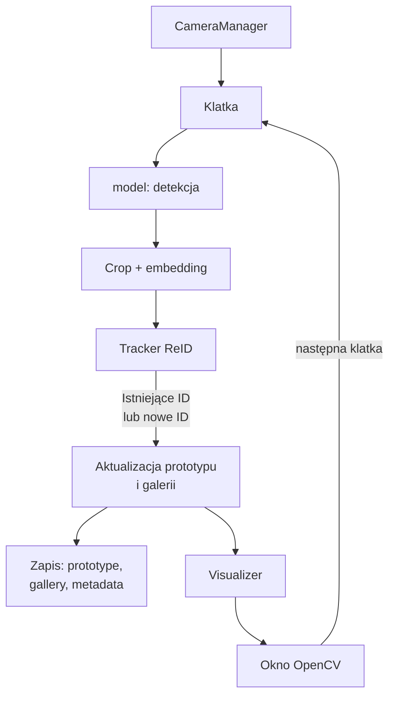

# Pipeline działania systemu

## Cel systemu

Program ma automatycznie analizować obraz z kamery, wykrywać osoby, nadawać im identyfikatory, zapisywać osadzenia oraz odzyskiwać ten sam identyfikator po chwilowym zniknięciu obiektu.

## Ogólne działanie

Działanie nie wymaga ręcznego dodawania osoby do bazy. 
System pobiera klatki z kamery lub pliku wideo, wykrywa obiekty, oblicza osadzenia i nadaje im identyfikatory instancji. Tracker pamięta tożsamości w trakcie sesji i może przywrócić ID po chwilowym zniknięciu obiektu.

## Obecna linia przepływu

### z docelowym zapisem osadzeń instancji

### Rozróżnienie

- **Detekcja klasy**: YOLO określa, że obiekt jest np. `person`, oraz podaje confidence.
- **ReID instancji**: embedding i tracker określają, czy jest to ta sama instancja co wcześniej.

Confidence YOLO nie jest miarą podobieństwa dwóch osób.