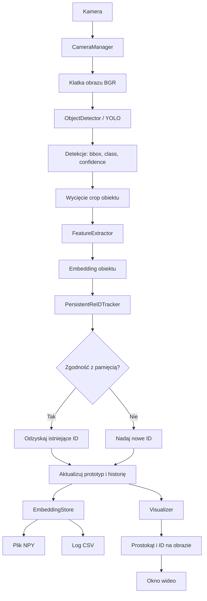

# Pipeline automatycznego rozpoznawania i ReID

## Cel systemu

Program ma automatycznie analizować obraz z kamery, wykrywać osoby i inne obiekty, nadawać im identyfikatory, zapisywać embeddingi oraz odzyskiwać ten sam identyfikator po chwilowym zniknięciu obiektu.

Działanie nie wymaga ręcznego dodawania osoby do bazy. Jeżeli system nie zna jeszcze embeddingu osoby, tworzy dla niej nowe ID i od tego momentu buduje jej pamięć embeddingów.

## Obecny przepływ danych



## Etapy pipeline’u

### 1. Otwarcie źródła obrazu

`CameraManager` otwiera kamerę zgodnie z `config.yaml` i pobiera kolejne klatki obrazu.

Wejście:

- kamera USB lub kamera Jetson,
- rozdzielczość z konfiguracji,
- backend `V4L2`, `GSTREAMER` albo domyślny OpenCV.

Wyjście:

- pojedyncza klatka obrazu w formacie BGR.

### 2. Detekcja obiektów

`ObjectDetector` przekazuje klatkę do YOLO.

Dla każdej detekcji zwracane są:

- `bbox` - współrzędne prostokąta,
- `class` - nazwa klasy, np. `person`,
- `confidence` - pewność detekcji YOLO,
- `class_id` - numeryczny identyfikator klasy.

`confidence` odpowiada na pytanie: „czy na obrazie znajduje się osoba lub inny obiekt?”. Nie odpowiada jeszcze na pytanie: „czy jest to ta sama osoba co wcześniej?”.

### 3. Wycięcie obiektu

Dla każdego `bbox` system wycina fragment obrazu z klatki. Współrzędne są ograniczane do rozmiaru obrazu, aby uniknąć błędnego indeksowania.

Jeżeli crop jest pusty albo nie można utworzyć embeddingu, detekcja nie bierze udziału w ReID.

### 4. Ekstrakcja embeddingu

`FeatureExtractor` zamienia crop na wektor cech.

- dla osoby może być użyty OSNet, jeżeli `torchreid` jest zainstalowany i włączony,
- w przeciwnym razie używany jest EfficientNet,
- dla pozostałych klas używany jest EfficientNet.

Embedding jest numerycznym opisem wyglądu obiektu. ReID porównuje embeddingi, a nie samą pewność YOLO.

### 5. Dopasowanie do pamięci ReID

`PersistentReIDTracker` przechowuje pamięć tożsamości w czasie działania programu.

Każda tożsamość zawiera między innymi:

- globalne `instance_id`,
- klasę obiektu,
- prototyp embeddingu,
- ostatni bounding box,
- liczbę próbek,
- informację, czy obiekt jest aktywny,
- liczbę klatek od ostatniego pojawienia się.

System porównuje nowy embedding z prototypami tej samej klasy.

Reguły:

1. Jeżeli podobieństwo embeddingu przekracza próg, detekcja odzyskuje istniejące ID.
2. Jeżeli obiekt jest aktywny, dodatkowym sygnałem może być IOU prostokątów.
3. Jeżeli nie ma wystarczającego dopasowania, system tworzy nowe ID.
4. ID jest globalne i rośnie tylko w górę.
5. Zniknięcie obiektu nie usuwa jego tożsamości z pamięci sesji.
6. Powrót obiektu może przywrócić poprzednie ID.

Przykład:

```text
Klatka 1: osoba A -> ID 1, osoba B -> ID 2
Klatka 2: osoba A znika
Klatka 3: nowa osoba C -> ID 3
Klatka 4: osoba A wraca -> ID 1
```

### 6. Aktualizacja prototypu

Po dopasowaniu tracker aktualizuje prototyp embeddingu metodą EMA. Dzięki temu pamięć może uwzględniać niewielkie zmiany pozycji, oświetlenia i wyglądu, ale pojedyncza słaba klatka nie powinna całkowicie zmienić tożsamości.

### 7. Automatyczny zapis embeddingu

`EmbeddingStore` zapisuje każdą zaakceptowaną próbkę:

```text
collected_embeddings/
    embeddings_log.csv
    identities.json
    person/
        person_1_<timestamp>.npy
        person_2_<timestamp>.npy
    car/
        car_3_<timestamp>.npy
```

CSV zawiera czas zapisu, klasę, ID, ścieżkę do pliku embeddingu i pewność detekcji.

`identities.json` przechowuje skrócone metadane tożsamości. Pełny prototyp embeddingu jest obecnie utrzymywany w pamięci trackera; zapisane próbki `.npy` mogą służyć do późniejszego odtworzenia pamięci.

### 8. Wizualizacja

`Visualizer` rysuje na obrazie:

- bounding box,
- klasę obiektu,
- globalne ID,
- confidence YOLO.

Przykładowa etykieta:

```text
person_1 | 0.94
```

### 9. Wyświetlanie wideo

Oznaczona klatka jest wyświetlana w oknie OpenCV. Pętla działa do momentu:

- naciśnięcia `q`,
- naciśnięcia `ESC`,
- błędu lub zamknięcia źródła obrazu.

Po zakończeniu kamera jest zwalniana, a okna OpenCV zamykane.

## Docelowy pipeline wideo

Docelowy program powinien mieć jeden główny przepływ:

```text
camera.sh
  -> główny moduł wideo
  -> CameraManager
  -> ObjectDetector
  -> FeatureExtractor
  -> PersistentReIDTracker
  -> EmbeddingStore
  -> Visualizer
  -> okno wideo / GUI
```

GUI powinno sterować tym samym pipeline’em, a nie uruchamiać drugą niezależną implementację detekcji i ReID. Dzięki temu tryb automatyczny, tryb testowy i zapis danych będą korzystały z identycznych zasad przydzielania ID.

## Najważniejsze rozróżnienie

W systemie występują dwa różne rodzaje identyfikacji:

1. **Detekcja klasy** - YOLO mówi, że obiekt jest osobą (`person`) z określoną pewnością.
2. **ReID instancji** - tracker ustala, czy jest to ta sama osoba co wcześniej i nadaje jej globalne ID.

Wysokie `confidence` dla klasy `person` nie gwarantuje poprawnego ReID. Do ReID potrzebny jest embedding oraz poprawnie działający tracker z pamięcią tożsamości.

## Parametry wymagające strojenia

- `confidence_threshold` - minimalna pewność detekcji YOLO,
- `similarity_threshold` - minimalne podobieństwo embeddingów dla odzyskania ID,
- `iou_threshold` - pomocnicze dopasowanie przestrzenne aktywnego obiektu,
- rozmiar i jakość cropa osoby,
- model embeddingów: EfficientNet lub dedykowany OSNet,
- liczba i jakość próbek zapisywanych dla jednej tożsamości.

## Ograniczenia

ReID nie jest dowodem tożsamości człowieka. Przy zasłonięciu, zmianie ubrania, słabym oświetleniu lub bardzo podobnych osobach może powstać błędne dopasowanie albo nowe ID. Próg podobieństwa powinien być sprawdzony na nagraniach z rzeczywistej kamery.
