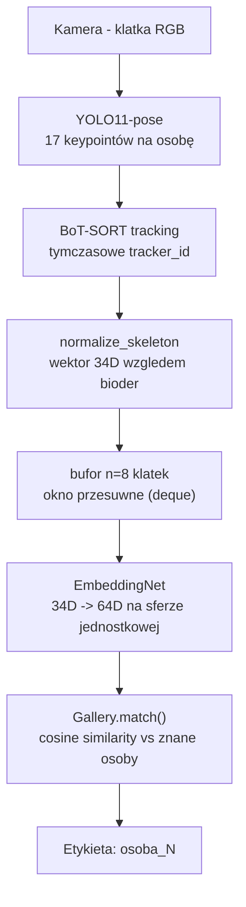
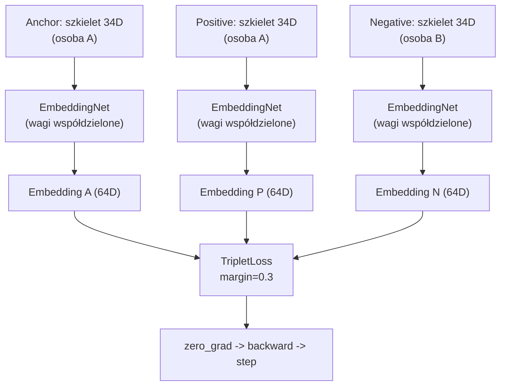
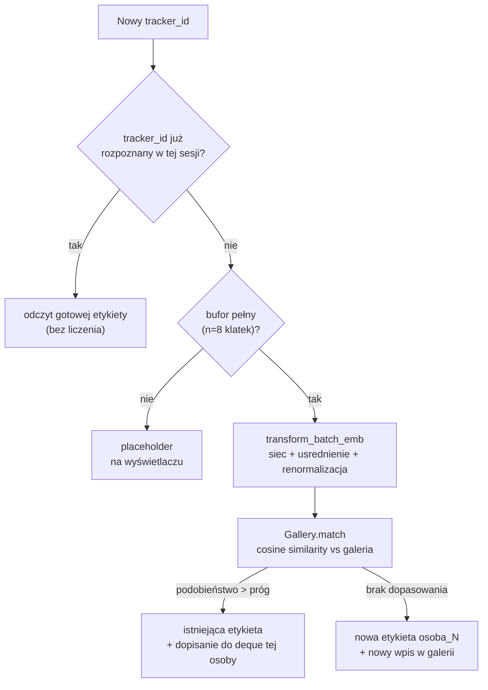

# Re-identyfikacja osób na podstawie szkieletu (skeleton-based re-ID)

Moduł re-identyfikacji osób oparty na proporcjach szkieletu (keypoints), przeznaczony do
działania w czasie rzeczywistym na urządzeniu Jetson zamontowanym na dronie. Projekt jest
częścią większego systemu, w którym równolegle działa niezależny moduł re-identyfikacji
oparty na wyglądzie (appearance-based, CNN embeddings) - docelowo oba sygnały zostaną
połączone metodą late fusion (ważona suma cosine similarity).

## Spis treści

- [Jak to działa](#jak-to-działa)
- [Architektura](#architektura)
- [Ograniczenia](#ograniczenia)
- [Struktura repozytorium](#struktura-repozytorium)
- [Instalacja](#instalacja)
- [Przygotowanie danych treningowych](#przygotowanie-danych-treningowych)
- [Trening](#trening)
- [Uruchomienie na żywo](#uruchomienie-na-żywo)

## Jak to działa

Pipeline na żywo, od klatki z kamery do etykiety wyświetlonej na ekranie:



Tracker (BoT-SORT) daje krótkoterminową ciągłość - ten sam `tracker_id`, dopóki osoba jest
widoczna. Gdy tracker zgubi osobę (zasłonięcie, wyjście z kadru) i nada jej nowy
`tracker_id` po powrocie, embedding szkieletu pozwala rozpoznać, że to ta sama fizyczna
osoba, mimo zmiany identyfikatora nadanego przez tracker.

## Architektura

### Trening - sieć tripletowa (triplet network)

Model uczony jest metryką odległości (metric learning), nie klasyfikacją zamkniętego
zbioru osób - dzięki temu system jest *open-set*: potrafi rozpoznać i zarejestrować
osobę, której nigdy wcześniej nie widział, bez ponownego treningu.



`EmbeddingNet` MLP (34 → 128 → 64 → 64) z BatchNorm i ReLU, kończący się
normalizacją L2 - embedding zawsze leży na sferze jednostkowej, dzięki czemu cosine
similarity sprowadza się do zwykłego iloczynu skalarnego. Wytrenowany na
[CASIA-B](http://www.cbsr.ia.ac.cn/english/GaitDatabases.asp) (przetworzone
keypointy z projektu [GaitGraph](https://github.com/tteepe/GaitGraph)).

### Galeria - rozpoznawanie w ramach jednej sesji



Galeria (`Gallery`) przechowuje do `max_vecs` ostatnich embeddingów na osobę,
uśrednianych i renormalizowanych przy każdym porównaniu - pojedynczy zaszumiony
odczyt nie dominuje dopasowania. Galeria istnieje, w ramach jednej
sesji uruchomienia kamery.

## Ograniczenia

- **Rozpoznawanie po proporcjach ciała w pojedynczej klatce, nie po dynamice chodu.**
  `EmbeddingNet` przetwarza każdą klatkę niezależnie - nie ma mechanizmu sekwencyjnego
  (LSTM/graf czasowo-przestrzenny), który uczyłby się wzorca ruchu.
- **Wrażliwość na kadrowanie kamery.** Normalizacja opiera się na pozycji bioder - jeśli
  biodra są poza kadrem lub słabo widoczne (np. kamera laptopa pokazująca głównie górę
  ciała), jakość embeddingu na pewno spadnie (wymaga testów).
- **Galeria nie jest trwała między uruchomieniami.**
- **Brak deduplikacji tożsamości.** Jeśli ta sama osoba przez pomyłkę dostanie dwie różne
  etykiety (np. przez szum w pojedynczym dopasowaniu), system obecnie ich nie scala.

## Struktura repozytorium

```
.
├── src/                        # kod biblioteczny (importowalny)
│   ├── skeleton_utils.py       # normalizacja keypointów
│   ├── model.py                # EmbeddingNet, TripletLoss
│   ├── dataset.py              # TripletGaitDataset
│   └── gallery.py              # Gallery, transform_batch_emb
├── scripts/                    # punkty wejścia (uruchamiane bezpośrednio)
│   ├── preprocess.py           # konwersja CSV (CASIA-B) -> .npz
│   ├── train.py                # trening EmbeddingNet
│   └── live_pipeline.py        # kamera + YOLO + BoT-SORT + re-ID na żywo
├── test_cases/
│   └── test_gallery.py         # testy jednostkowe klasy Gallery
├── embedding_net_best.pt        # wytrenowane wagi
├── requirements.txt
└── .gitignore
```

## Instalacja

Wymagany Python 3.10+.

```bash
pip install -r requirements.txt
```

`requirements.txt` obejmuje `numpy`, `opencv-python`, `ultralytics` - bez PyTorcha, który
instaluje się osobno, zależnie od platformy (patrz niżej).

### PyTorch - instalacja zależna od platformy

PyTorch **celowo nie jest** w `requirements.txt` - build zależy od dostępnego sprzętu
(CUDA / MPS / CPU). Komendę można skopiować z 
[pytorch.org/get-started/locally](https://pytorch.org/get-started/locally/), wybierając
wersję CUDA **nie wyższą** niż ta zgłaszana przez `nvidia-smi`.

**Windows / Linux z GPU NVIDIA** (testowane na RTX 2070 Super, sterownik CUDA 13.1):

```bash
pip install torch --index-url https://download.pytorch.org/whl/cu128
```

**macOS:**

```bash
pip install torch
```

**Weryfikacja instalacji:**

```bash
python -c "import torch; print(torch.cuda.is_available() or torch.backends.mps.is_available())"
```

Kod projektu sam wybiera najlepsze dostępne urządzenie:

```python
if torch.cuda.is_available():
    device = torch.device("cuda")
elif torch.backends.mps.is_available():
    device = torch.device("mps")
else:
    device = torch.device("cpu")
```

## Przygotowanie danych treningowych

Model trenowany jest na przetworzonych keypointach z CASIA-B, udostępnionych przez
projekt GaitGraph (format COCO-17, zgodny z tym, co zwraca `yolo11n-pose`).

1. Pobierz `data.zip`:
   [github.com/tteepe/GaitGraph/releases/download/v0.1/data.zip](https://github.com/tteepe/GaitGraph/releases/download/v0.1/data.zip)
   (~800 MB)
2. Rozpakuj **tylko** trzy pliki do folderu `gait_data/` w katalogu głównym repo:
   `casia-b_pose_train.csv`, `casia-b_pose_valid.csv`, `casia-b_pose_test.csv`
3. Uruchom konwersję do formatu `.npz`:

   ```bash
   python -m scripts.preprocess
   ```

   Wynik: `gait_data/train.npz`, `gait_data/valid.npz`, `gait_data/test.npz`.

## Trening

```bash
python -m scripts.train
```

Domyślnie: 20 epok, `batch_size=1024`, `margin=0.3`, Adam z `lr=1e-3`. Najlepszy model
(wg `valid_loss`) zapisywany jest jako `embedding_net_best.pt` w katalogu głównym.

Wyżej wymienione wartości wymagają kalibracji. Są to wartości domyślne.

## Uruchomienie na żywo

```bash
python -m scripts.live_pipeline
```

Wymaga `embedding_net_best.pt` i `yolo11n-pose.pt` (Ultralytics pobiera automatycznie
przy pierwszym użyciu) w katalogu głównym. Wciśnij `q`, aby zakończyć.

Parametry do dostrojenia na górze pliku `scripts/live_pipeline.py`:

| Parametr | Znaczenie |
|---|---|
| `n_buffers` | rozmiar okna przesuwnego klatek na tracker_id (domyślnie 8) |
| `similarity_margin` | próg cosine similarity do uznania dopasowania (domyślnie 0.7) |
| `Gallery(max_vecs=...)` | ile embeddingów na osobę przechowuje galeria (domyślnie 5) |

Wyżej wymienione wartości wymagają kalibracji. Są to wartości domyślne.
