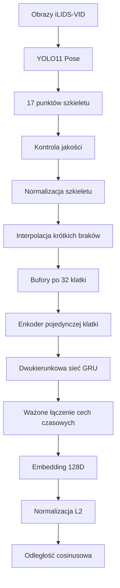

# Rozpoznawanie i ponowna identyfikacja osób na podstawie sekwencji punktów szkieletu


## 1. Streszczenie

Celem metody było identyfikacja osób na podstawie sekwencji punktów szkieletu człowieka.

Jego zadaniem jest przekształcenie krótkiej sekwencji ruchu człowieka do wektora cech - embedin(128), a następnie określenie, czy dwie sekwencje prawdopodobnie przedstawiają tę samą osobę za pomocą podobieństwa cosinusowego.

W projekcie wykorzystałem:

- model YOLO11 Pose do wykrywania punktów charakterystycznych sylwetki,
- normalizację szkieletu względem środka bioder i długości tułowia,
- bufory czasowe zawierające 32 kolejne klatki,
- dwukierunkową sieć GRU do analizy zmian pozy w czasie,
- embedding o wymiarze 128,
- odległość cosinusową do porównywania reprezentacji,
- Batch-Hard Triplet Loss oraz pomocniczą klasyfikację osób.

Wytłumacznie pojęć:

Bufor - jest to ostatni zapamiętany szkielet u danej osoby, przykład ostatnie 32 klatki danej osoby

Okno przesówne - czyli przy uczenie wykorzystałem okno przesówne które co 8 kaltek (stride) tworzyło kolejne okno o pojemności 32 klatete - okna na siebie nachodzą

Do przygotowania danych wykorzystano zbiór **iLIDS-VID**, zawierający sekwencje osób zarejestrowane przez dwie kamery (dwa różne kąty).

Najlepszy model osiągnął wynik **Validation Rank-1 równy 15%**. Wynik ten jest lepszy od losowego dopasowania, ale jednocześnie pokazuje, że sam szkielet 2D zawiera zbyt mało informacji, aby stworzyć niezawodny system identyfikacji osób działający w warunkach rzeczywistych.

Projekt należy traktować jako kompletny prototyp badawczo-inżynierski, który realizuje cały proces od przygotowania danych do treningu i oceny modelu.

---

## 2. Przepływ projektu


```text
sekwencja obrazów osoby
        ↓
wykrycie punktów szkieletu
        ↓
normalizacja współrzędnych
        ↓
utworzenie bufora czasowego
        ↓
sieć neuronowa
        ↓
embedding osoby
        ↓
porównanie cosinusowe
```

System miał spełniać następujące wymagania:

1. Przetwarzać sekwencje obrazów zamiast pojedynczej klatki.
2. Wykorzystywać ruch oraz układ ciała człowieka.
3. Być odpornym na przesunięcie osoby w obrazie.
4. Być odpornym na zmianę rozmiaru sylwetki.
5. Obsługiwać brakujące punkty szkieletu. --> Tutaj użyłem interpolacji gdzy jakaś kluczowa część ciała była poza kadrem 
6. Przekształcać sekwencję do nowej przestrzeni cech. --> Utworzenie Embedingu 128d
7. Porównywać osoby za pomocą odległości cosinusowej.


---

## 3. Person Re-Identification

Person Re-Identification, w skrócie Re-ID, polega na określeniu, czy osoba widoczna w jednej sekwencji jest tą samą osobą, która została zarejestrowana wcześniej lub przez inną kamerę.

Nie jest to klasyczna klasyfikacja zamkniętego zbioru osób.

W klasyfikacji model odpowiada na pytanie:

> Która z wcześniej znanych klas znajduje się na obrazie?

W Re-ID model odpowiada na pytanie:

> Jak podobna jest ta osoba do wcześniej zaobserwowanych osób?

Model tworzy wektor cech, czyli embedding:

```text
sekwencja osoby → embedding 128D
```

Dwa embeddingi mogą być następnie porównane bez konieczności ponownego trenowania klasyfikatora.

---

## 4. Zastosowany zbiór danych

### 4.1. iLIDS-VID

W projekcie wykorzystałem zbiór **iLIDS-VID**.

Zbiór po rozpakowaniu zawierał:

| Właściwość | Wartość |
|---|---:|
| Liczba osób | 300 |
| Liczba kamer | 2 |
| Liczba sekwencji | 600 |
| Liczba obrazów | 42 459 |

Każda osoba występuje w dwóch sekwencjach:

```text
personXXX/cam1
personXXX/cam2
```

Dzięki temu możliwe było sprawdzanie, czy model potrafi połączyć reprezentację osoby z pierwszej kamery z reprezentacją tej samej osoby z drugiej kamery.

Oficjalna strona zbioru:

[QMUL iLIDS-VID Re-ID Dataset](https://xiatian-zhu.github.io/downloads_qmul_iLIDS-VID_ReID_dataset.html)

### 4.2. Podział danych


| Część zbioru | Liczba przypisanych osób | Liczba buforów |
|---|---:|---:|
| Train | 210 | 2188 |
| Validation | 45 | 474 |
| Test | 45 | 500 |
| **Łącznie** | **300** | **3162** |

W części treningowej 209 osób miało co najmniej jeden poprawny bufor. Jedna z 210 przypisanych osób nie utworzyła żadnego bufora spełniającego wymagania jakościowe.

Łącznie 34 z 600 sekwencji nie utworzyły żadnego poprawnego bufora.

Zastosowany sposób podziału zapobiega przeciekowi danych. Ta sama osoba nie mogła występować jednocześnie w części treningowej i walidacyjnej lub testowej.


---

## 5. Ogólny przepływ systemu



System składa się z czterech głównych etapów:

1. Ekstrakcja punktów szkieletu.
2. Przygotowanie i normalizacja danych.
3. Utworzenie embeddingu przez sieć neuronową.
4. Porównanie embeddingów za pomocą odległości cosinusowej.


---

## 6. Ekstrakcja pozy człowieka

### 6.1. YOLO11 Pose

Do wykrywania sylwetki oraz punktów charakterystycznych wykorzystano model:

```text
yolo11n-pose.pt
```

Model zwraca 17 punktów zgodnych z formatem COCO:

| Indeks | Punkt |
|---:|---|
| 0 | nos |
| 1 | lewe oko |
| 2 | prawe oko |
| 3 | lewe ucho |
| 4 | prawe ucho |
| 5 | lewy bark |
| 6 | prawy bark |
| 7 | lewy łokieć |
| 8 | prawy łokieć |
| 9 | lewy nadgarstek |
| 10 | prawy nadgarstek |
| 11 | lewe biodro |
| 12 | prawe biodro |
| 13 | lewe kolano |
| 14 | prawe kolano |
| 15 | lewa kostka |
| 16 | prawa kostka |

Każdy punkt jest reprezentowany przez:

```text
x, y, confidence
```

Dla pojedynczej klatki uzyskiwana jest więc tablica:

```text
(17, 3)
```

### 6.2. Wybór osoby

Obrazy zbioru iLIDS-VID są przycięte wokół konkretnej osoby, jednak YOLO może czasami zwrócić więcej niż jedno wykrycie.

Główne wykrycie jest wybierane na podstawie:

- pewności detekcji,
- odległości środka prostokąta od środka obrazu,
- powierzchni prostokąta względem obrazu.

Preferowana jest osoba o wysokiej pewności, znajdująca się blisko środka i zajmująca dużą część obrazu.

### 6.3. Test jakości ekstrakcji

Przed przetworzeniem całego zbioru wykonano test na 300 losowych klatkach, po 150 z każdej kamery.

Po dodaniu kontroli geometrii szkieletu około 97% sprawdzonych klatek zostało uznanych za użyteczne.

Test obejmował między innymi:

- obecność odpowiedniej liczby punktów,
- widoczność barków,
- widoczność bioder,
- położenie punktów wewnątrz prostokąta osoby,
- pionową kolejność bioder, kolan i kostek,
- kontrolę nienaturalnie długich odcinków ciała.

Wynik potwierdził, że model YOLO Pose może być wykorzystany do przygotowania danych z iLIDS-VID pomimo niskiej rozdzielczości obrazów.

---

## 7. Normalizacja szkieletu

Surowe współrzędne punktów zależą od:

- położenia osoby w obrazie,
- odległości od kamery,
- rozmiaru prostokąta detekcji,
- rozdzielczości obrazu.

Bez normalizacji model mógłby uczyć się położenia człowieka zamiast sposobu poruszania.

### 7.1. Środek układu współrzędnych

Najpierw obliczany jest środek bioder:

\[
c_h = \frac{p_{11} + p_{12}}{2}
\]

gdzie:

- \(p_{11}\) oznacza lewe biodro,
- \(p_{12}\) oznacza prawe biodro.

Środek bioder staje się początkiem układu współrzędnych:

\[
c_h = (0,0)
\]

### 7.2. Skala szkieletu

Obliczany jest również środek barków:

\[
c_s = \frac{p_5 + p_6}{2}
\]

Skalę wyznacza długość tułowia:

\[
s = \lVert c_s - c_h \rVert_2
\]

Każdy widoczny punkt jest następnie normalizowany:

\[
\hat{p}_i = \frac{p_i - c_h}{s}
\]

Dzięki temu:

- przesunięcie osoby nie zmienia reprezentacji,
- zmiana rozmiaru osoby nie zmienia istotnie reprezentacji,
- środek bioder zawsze znajduje się w punkcie `(0, 0)`,
- długość tułowia jest w przybliżeniu równa `1`.

### 7.3. Warunki poprawności

Do wykonania normalizacji wymagane są:

- lewy bark,
- prawy bark,
- lewe biodro,
- prawe biodro.

Jeżeli jeden z tych punktów ma zbyt niską pewność, klatka nie jest uznawana za bezpośrednio poprawną.

---

## 8. Obsługa brakujących punktów

Wyniki detekcji pozy nie są idealne. Niektóre punkty mogą chwilowo zniknąć przez:

- zasłonięcie,
- rozmycie ruchu,
- niską rozdzielczość,
- częściowe wyjście osoby poza obraz,
- nieprawidłową detekcję.

W projekcie zastosowano trzy maski.

### 8.1. `observed_mask`

Kształt:

```text
(T, 17)
```

Wartość `True` oznacza, że punkt został bezpośrednio wykryty przez YOLO.

### 8.2. `available_mask`

Kształt:

```text
(T, 17)
```

Wartość `True` oznacza, że współrzędna jest dostępna:

- bezpośrednio z YOLO,
- albo została uzupełniona interpolacją.

### 8.3. `frame_valid_mask`

Kształt:

```text
(T,)
```

Wartość `True` oznacza, że cała klatka spełniła warunki normalizacji.

### 8.4. Interpolacja

Krótkie braki znajdujące się pomiędzy dwoma poprawnymi pomiarami są uzupełniane interpolacją liniową.

Dla punktów \(p_a\) oraz \(p_b\) wartość pośrednia jest wyznaczana jako:

\[
p(t) = (1-\alpha)p_a + \alpha p_b
\]

Punkty interpolowane otrzymują confidence równy `0`, dzięki czemu model może odróżnić dane wykryte od danych oszacowanych.

Dłuższe braki nie są uzupełniane.

---

## 9. Tworzenie buforów czasowych

Model nie analizuje pojedynczego szkieletu. Jego wejściem jest sekwencja:

```text
32 kolejne klatki
```

Z pełnych sekwencji tworzono zachodzące na siebie okna:

```text
długość okna: 32
przesunięcie: 8
```

Przykład:

```text
okno 0: klatki  0–31
okno 1: klatki  8–39
okno 2: klatki 16–47
okno 3: klatki 24–55
```

Okno było zachowywane, jeżeli spełniało wymagania:

- minimum 65% poprawnych klatek,
- minimum 45% bezpośrednio wykrytych punktów.

Każdy zapisany bufor ma format:

```text
keypoints:        (32, 17, 3)
observed_mask:    (32, 17)
available_mask:   (32, 17)
frame_valid_mask: (32,)
```

## 10. Struktura projektu

```text
project_jetson_renode/
│
├── config/
│   └── train.yaml
│
├── data/
│   ├── metadata/
│   ├── processed/
│   └── raw/
│
├── models/
│   ├── yolo11n-pose.pt
│   ├── skeleton_reid_best.pt
│   └── skeleton_reid_last.pt
│
├── runs/
│   └── reid_training_history.csv
│
├── scripts/
│   ├── test_ilids_pose_quality.py
│   ├── prepare_ilids_sample.py
│   ├── prepare_ilids_sample_windows.py
│   ├── prepare_ilids_dataset.py
│   ├── audit_ilids_dataset.py
│   ├── inspect_training_batch.py
│   ├── inspect_reid_network.py
│   ├── inspect_training_step.py
│   └── train_reid.py
│
├── src/
│   ├── datasets/
│   │   ├── identity_sampler.py
│   │   ├── sequence_windows.py
│   │   └── skeleton_dataset.py
│   │
│   ├── pose/
│   │   ├── detector.py
│   │   └── normalization.py
│   │
│   └── reid/
│       ├── evaluation.py
│       ├── losses.py
│       └── network.py
│
├── tests/
│   ├── test_normalization.py
│   ├── test_sequence_windows.py
│   ├── test_skeleton_dataset.py
│   ├── test_reid_network.py
│   └── test_reid_losses.py
│
├── README.md
├── requirements.txt
└── .gitignore
```

---

## 11. Opis najważniejszych plików

### `src/pose/detector.py`

Odpowiada za:

- załadowanie YOLO11 Pose,
- wykonanie predykcji,
- wybór głównej osoby,
- zwrócenie prostokąta i punktów szkieletu.

### `src/pose/normalization.py`

Odpowiada za:

- sprawdzenie wymaganych punktów,
- wyznaczenie środka bioder,
- wyznaczenie długości tułowia,
- przesunięcie i skalowanie punktów,
- utworzenie maski widoczności.

### `src/datasets/sequence_windows.py`

Odpowiada za:

- interpolację krótkich braków,
- zachowanie informacji o punktach wykrytych i uzupełnionych,
- tworzenie okien po 32 klatki,
- odrzucanie okien o zbyt niskiej jakości.

### `src/datasets/skeleton_dataset.py`

Implementuje klasę PyTorch Dataset.

Odczytuje pliki `.npz` i zwraca:

- punkty szkieletu,
- maski,
- identyfikator osoby,
- etykietę klasyfikacyjną,
- numer kamery.

### `src/datasets/identity_sampler.py`

Tworzy batch w układzie:

```text
P osób × K próbek każdej osoby
```

W zastosowanej konfiguracji:

```text
8 osób × 4 próbki = 32
```

### `src/reid/network.py`

Zawiera:

- enkoder klatki,
- dwukierunkowe GRU,
- ważone łączenie informacji czasowej,
- warstwę embeddingu,
- klasyfikator pomocniczy.

### `src/reid/losses.py`

Zawiera:

- macierz odległości cosinusowych,
- Batch-Hard Triplet Loss,
- połączoną funkcję straty Re-ID.

### `src/reid/evaluation.py`

Odpowiada za:

- obliczenie embeddingów,
- tworzenie prototypów osoby dla każdej kamery,
- ocenę cam1 → cam2 i cam2 → cam1,
- obliczenie Rank-1.

### `scripts/prepare_ilids_dataset.py`

Przetwarza cały zbiór:

```text
obrazy
→ YOLO Pose
→ normalizacja
→ sekwencje NPZ
→ bufory NPZ
→ metadane CSV
```

### `scripts/audit_ilids_dataset.py`

Sprawdza:

- obecność plików,
- kształty tablic,
- typy danych,
- brak wartości NaN i nieskończoności,
- zgodność identyfikatorów,
- poprawność masek.

Wszystkie 3162 bufory przeszły kontrolę.

### `scripts/train_reid.py`

Realizuje:

- trening,
- walidację po każdej epoce,
- zapis najlepszego i ostatniego checkpointu,
- scheduler learning rate,
- early stopping,
- zapis historii treningu.

---

## 12. Notak podsumowująca

Moim najwięszym problemem, na który napotkałem to był właśnie zbiór danych. Gdyż zostałem skuszony jak testowałem i sprawdzałem sobie jaki procent wszystkich klatek wykrywa punkty i z jaką dokładnością - to te testy wychodziły bardzo zadawalajaco.

Niestety zbiór danych okazał się być niewystarczający pod zadanie, co było widać na późnieszjych testach jakościowych gdzie model radził sobie znacznie lepiej niż model losowy ale nie sprostał na danych testowych.

Dalszym krokiem jaki mogę podjąć w celu poprawy modelu jest zmiana zbioru testowego i refectoring pliku odczytującego dane 